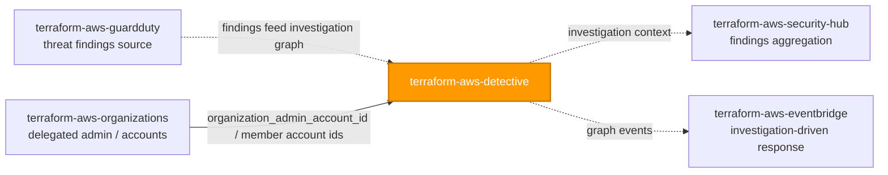
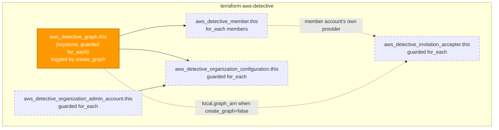

# 🟧 AWS **Detective** Terraform Module

> **Stands up an Amazon Detective behavior graph for multi-account security investigation — the regional graph (keystone), member-account invitations, the cross-account invitation accepter, and AWS Organizations delegated-administrator / org-wide auto-enrollment, all correctly ordered and toggleable per invocation shape.** Built for the AWS provider **v6.x**.

[](https://www.terraform.io)
[](https://registry.terraform.io/providers/hashicorp/aws/latest)
[](#)
[](#)
[](#)

---

## 🧩 Overview

- 🕵️ **Investigation graph, fully wired.** Creates `aws_detective_graph` (the keystone) plus everything meaningless without it: member-account invitations, the cross-account invitation accepter, and AWS Organizations delegated-admin / org-wide auto-enrollment.
- 🔀 **Two invocation shapes, one module.** Invoke with `create_graph = true` from the account that will **own** the graph (administrator), or `create_graph = false` from a **member account's own provider context** purely to accept an invitation and/or read organization state against an externally-supplied `graph_arn`.
- 🔗 **Correct ordering, automatically.** `organization_admin_account` is sequenced before `organization_configuration` via `depends_on` (no direct attribute reference exists between them, since they typically run from different accounts) — mirroring the pattern in `terraform-aws-inspector2`.
- 🏢 **Org-wide delegated administrator — same shape as GuardDuty / Security Hub.** One designated admin account manages the org's Detective behavior graph and can auto-enroll new accounts as they join.
- 🤝 **A member must ACCEPT before it's fully part of the graph.** `aws_detective_member` only sends the invitation from the administrator account; `aws_detective_invitation_accepter` — run in the **member's own provider context** — completes the join, mirroring the cross-account accepter pattern used elsewhere in this library (e.g. GuardDuty's invite accepter).
- 🏷️ **Tags where they're accepted.** `var.tags` flows to the **only** taggable Detective resource — the graph — and merges with provider `default_tags`; members, the accepter, and both organization resources are **not** taggable.
- 🧮 **Members as data.** `members` is a `map(object(...))` collection rendered with `for_each`, keyed by a stable caller string.

> 💡 **Why it matters:** GuardDuty tells you *something* happened; Detective helps you figure out *what actually happened* — it automatically organizes findings, VPC flow logs, and DNS/API activity into a graph an investigator can pivot through in seconds instead of stitching together CloudTrail queries by hand. For an FI under regulatory oversight handling PII, that shortens the single most expensive phase of an incident — root-cause investigation — from days to minutes, and doing it consistently across every account starts with `terraform-aws-guardduty` enabled first.

---

## ❤️ Support this project

If these Terraform modules have been helpful to you or your organization, I'd appreciate your support in any of the following ways:

- ⭐ **Star this repository** to help others discover this Terraform module.
- 🤝 **Connect with me on LinkedIn:** [linkedin.com/in/microsoftexpert](https://www.linkedin.com/in/microsoftexpert)
- ☕ **Buy me a coffee:** [buymeacoffee.com/microsoftexpert](https://buymeacoffee.com/microsoftexpert)

Whether it's a star, a professional connection, or a coffee, every gesture helps keep these modules actively maintained and continually improving. Thank you for being part of the community!

---

## 🗺️ Where this fits in the family

`terraform-aws-detective` is a **security investigation consumer** — it sits downstream of GuardDuty's findings and upstream of aggregation/response, and shares its delegated-administrator wiring with AWS Organizations.



> ⚠️ **Enable GuardDuty first.** Detective ingests GuardDuty findings, VPC Flow Logs, and DNS query logs as its primary evidence sources. It will still enable and analyze flow/DNS data without GuardDuty, but the investigative payoff is materially smaller — `terraform-aws-guardduty` is not a Terraform-level dependency of this module, but it is the operationally recommended prerequisite.

---

## 🧬 What this module builds



| Resource | Count | Created when |
|---|---|---|
| `aws_detective_graph.this` | 0 or 1 | `create_graph = true` (default) |
| `aws_detective_member.this` | 0..N | one per `members` entry |
| `aws_detective_organization_admin_account.this` | 0 or 1 | `enable_organization_admin_account = true` |
| `aws_detective_organization_configuration.this` | 0 or 1 | `organization_configuration != null` |
| `aws_detective_invitation_accepter.this` | 0 or 1 | `accept_invitation = true` |

---

## ✅ Provider / Versions

| Requirement | Version |
|---|---|
| Terraform | `>= 1.12.0` |
| `hashicorp/aws` | `>= 6.0, < 7.0` |

The module declares only a `required_providers` block (`providers.tf`) and inherits the configured provider. There is **no `provider {}` block** and **no credential variable** — credentials resolve through the standard AWS chain at the root/pipeline level (env vars → SSO/shared credentials → `assume_role` → instance profile / IRSA → OIDC web identity). Detective is **regional**: the graph and all children are created in the inherited provider's Region. To cover multiple Regions, instantiate this module once per Region with provider aliases.

---

## 🔑 Required IAM Permissions

Least-privilege actions the **Terraform execution identity** needs to manage this module. Split by resource because the organization admin-account and org-configuration paths run from **different accounts** (management vs. delegated administrator).

| Action | Required for | Notes |
|---|---|---|
| `detective:CreateGraph`, `detective:DeleteGraph`, `detective:ListGraphs`, `detective:TagResource`, `detective:UntagResource`, `detective:ListTagsForResource` | Graph lifecycle / tagging | The only taggable resource; only when `create_graph = true` |
| `detective:CreateMembers`, `detective:DeleteMembers`, `detective:GetMembers`, `detective:ListMembers` | Member-account invitations | Administrator account only; when `members` is set |
| `detective:AcceptInvitation`, `detective:GetMembers`, `detective:DisassociateMembership` | Invitation acceptance | **Member account** only; when `accept_invitation = true` |
| `detective:EnableOrganizationAdminAccount`, `detective:DisableOrganizationAdminAccount`, `detective:ListOrganizationAdminAccounts` | Delegated administrator | Organizations **management** account only |
| `organizations:EnableAWSServiceAccess`, `organizations:ListDelegatedAdministrators`, `organizations:RegisterDelegatedAdministrator`, `organizations:DeregisterDelegatedAdministrator`, `organizations:DescribeOrganization`, `organizations:DescribeAccount` | Delegated-admin registration is an Organizations-service action, not purely Detective | Management account only |
| `detective:UpdateOrganizationConfiguration`, `detective:DescribeOrganizationConfiguration` | Org-wide auto-enrollment policy | **Delegated administrator** account only |

> ℹ️ **No `iam:PassRole`.** No resource in this module assumes or passes an IAM role.

---

## 📋 AWS Prerequisites

- **Enable GuardDuty first (strongly recommended).** Detective's evidence sources are GuardDuty findings, VPC Flow Logs, and DNS query logs — the graph works without GuardDuty but is materially less useful.
- **One behavior graph per account per Region (hard limit).** Instantiating this module twice with `create_graph = true` in the same account+Region fails on the second graph. Use provider aliases (one module instance per Region).
- **Organization-wide delegated administrator — mirrors GuardDuty/Security Hub exactly.** One designated Detective delegated administrator account manages the org's graph and can auto-enroll new accounts; register it via `enable_organization_admin_account` from the **management** account before applying `organization_configuration` from the **delegated administrator** account.
- **Detective trusted access for AWS Organizations** (`aws_service_access_principals` including `detective.amazonaws.com`) must already be enabled on the Organization before `aws_detective_organization_admin_account` succeeds — a one-time Organizations-level action, typically performed in the root module or via `terraform-aws-organizations`, outside this module's control.
- **No service-linked role** is documented as required for Detective itself.
- **Quotas** (Region-specific; see the [Detective User Guide](https://docs.aws.amazon.com/detective/latest/adminguide/detective-quotas.html)):
 - **1 behavior graph** per account per Region.
 - **1,200 member accounts** per behavior graph (invited or organization-enrolled, combined).
 - Detective can only ingest data back to the account's existing log retention — enabling it late means historical activity prior to enablement is not retroactively analyzed.

---

## 📁 Module Structure

```
terraform-aws-detective/
├── providers.tf # required_providers (aws >= 6.0, < 7.0); no provider block
├── variables.tf # create_graph → graph_arn → members → org admin account → org configuration → accept_invitation → tags → timeouts
├── main.tf # graph (this, guarded) → members / org admin account / org configuration / invitation accepter
├── outputs.tf # id + arn + graph/member/org/accepter attrs + tags_all
├── README.md # this file
└── SCOPE.md # in/out-of-scope, IAM permissions, prerequisites, gotchas
```

---

## ⚙️ Quick Start

Smallest secure call — standalone graph, no members, no org wiring:

```hcl
module "detective" {
  source = "git::https://github.com/microsoftexpert/terraform-aws-detective?ref=v1.0.0"

  # create_graph = true (default) — a standalone behavior graph in this account+Region.

  tags = {
    Environment = "prod"
    CostCenter  = "1234"
  }
}
```

---

## 🔌 Cross-Module Contract

### Consumes

| Input | Type | Source module |
|---|---|---|
| `graph_arn` (when `create_graph = false`) | `string` (Detective graph ARN) | Another invocation of this module (administrator account's `arn` output) |
| `organization_admin_account_id` | `string` (12-digit account id) | Caller-supplied, or `data.aws_organizations_organization` / `data.aws_caller_identity` |
| `members[*].account_id` | `string` (12-digit account id) | Caller-supplied member/child account ids |

### Emits

| Output | Description | Consumed by |
|---|---|---|
| `id` | Graph id, or `null` when `create_graph = false` | State inspection |
| `arn` / `graph_arn` | Graph ARN (`arn:<partition>:detective:<region>:<account>:graph:<graph-id>`) — cross-resource reference type, or `null` when `create_graph = false` | Member-account module calls' `graph_arn` input; Security Hub integration; audit |
| `effective_graph_arn` | The graph ARN this call actually operates against — **never null** when the module manages any child resource | Internal wiring reference |
| `created_time` | Graph creation timestamp, or `null` | Audit |
| `tags_all` | All tags incl. provider `default_tags` on the graph, or `null` | Governance/audit |
| `member_ids` / `member_statuses` / `member_administrator_ids` / `member_volume_usage_bytes` | Maps of member label → id / status / administrator account id / daily ingest volume | Org rollup, membership health monitoring |
| `organization_admin_account_id` | Registered delegated administrator account id, or `null` | Audit; cross-check against `terraform-aws-guardduty` / `terraform-aws-security-hub` delegated admin |
| `organization_configuration_id` / `organization_auto_enable` | Org configuration state, or `null` | Compliance reporting |
| `invitation_accepter_id` | Accepter id, or `null` when `accept_invitation = false` | Audit/state inspection |

---

## 📚 Example Library

<details>
<summary><strong>1 · Minimal secure baseline (standalone graph)</strong></summary>

```hcl
module "detective" {
  source = "git::https://github.com/microsoftexpert/terraform-aws-detective?ref=v1.0.0"

  # create_graph = true — all defaults.
}
```
</details>

<details>
<summary><strong>2 · Tags (merge with provider <code>default_tags</code>)</strong></summary>

```hcl
# Caller's provider block owns default_tags; the module never sets it.
provider "aws" {
  default_tags { tags = { Owner = "security", ManagedBy = "terraform" } }
}

module "detective" {
  source = "git::https://github.com/microsoftexpert/terraform-aws-detective?ref=v1.0.0"

  tags = {
    Environment = "prod" # resource tag — wins over default_tags on key conflict
    DataClass   = "internal"
  }
}
# module.detective.tags_all == { Owner, ManagedBy, Environment, DataClass }
# Only the graph is taggable — members, the accepter, and both org resources are not.
```
</details>

<details>
<summary><strong>3 · Multi-account: invite member accounts (administrator account)</strong></summary>

```hcl
module "detective" {
  source = "git::https://github.com/microsoftexpert/terraform-aws-detective?ref=v1.0.0"

  members = {
    audit = {
      account_id    = "123456789012"
      email_address = "security+audit@financialpartners.com"
      message       = "Please accept to join the investigation graph."
    }
    sandbox = {
      account_id                 = "444455556666"
      email_address              = "security+sandbox@financialpartners.com"
      disable_email_notification = true
    }
  }
}
```
</details>

<details>
<summary><strong>4 · Accept an invitation (member account's own provider context)</strong></summary>

```hcl
provider "aws" {
  alias  = "member"
  region = "us-east-1"
  #... assume_role / profile targeting the MEMBER account
}

module "detective_member" {
  source    = "git::https://github.com/microsoftexpert/terraform-aws-detective?ref=v1.0.0"
  providers = { aws = aws.member }

  create_graph      = false # this account does not own a graph
  accept_invitation = true
  graph_arn         = module.detective.arn # the administrator's graph ARN
}
```
</details>

<details>
<summary><strong>5 · Organization-wide: register the delegated administrator (management account)</strong></summary>

```hcl
module "detective_admin" {
  source = "git::https://github.com/microsoftexpert/terraform-aws-detective?ref=v1.0.0"

  create_graph                      = false # the management account does not own the org's graph
  enable_organization_admin_account = true
  organization_admin_account_id     = "222233334444" # the security-tooling account
}
```
</details>

<details>
<summary><strong>6 · Organization-wide: apply the auto-enrollment policy (delegated administrator account)</strong></summary>

```hcl
provider "aws" {
  alias = "delegated_admin"
  #... targets account 222233334444
}

module "detective_delegated_admin" {
  source    = "git::https://github.com/microsoftexpert/terraform-aws-detective?ref=v1.0.0"
  providers = { aws = aws.delegated_admin }

  # create_graph = true — the delegated administrator owns the org's graph.
  organization_configuration = {
    auto_enable = true # SECURE-BY-DEFAULT TRADEOFF: new org accounts are auto-enrolled —
    # continuous coverage, but Terraform is no longer the sole source
    # of truth for membership. See README § Design Principles.
  }
}
```
</details>

<details>
<summary><strong>7 · Secure-by-default opt-out: individual invitations instead of org auto-enrollment</strong></summary>

```hcl
module "detective" {
  source = "git::https://github.com/microsoftexpert/terraform-aws-detective?ref=v1.0.0"

  # organization_configuration left null (default) — every account is invited
  # explicitly and individually via `members`, keeping Terraform as the single
  # source of truth for graph membership at the cost of a manual invite step
  # for every new account.
  members = {
    audit = { account_id = "123456789012", email_address = "security+audit@financialpartners.com" }
  }
}
```
</details>

<details>
<summary><strong>8 · Suppress the root-user invitation email</strong></summary>

```hcl
module "detective" {
  source = "git::https://github.com/microsoftexpert/terraform-aws-detective?ref=v1.0.0"

  members = {
    sandbox = {
      account_id                 = "444455556666"
      email_address              = "security+sandbox@financialpartners.com"
      disable_email_notification = true # default false — root user IS notified by default
    }
  }
}
```
</details>

<details>
<summary><strong>9 · <code>for_each</code> pattern: bulk-invite from a map of business units</strong></summary>

```hcl
locals {
  business_unit_accounts = {
    lending   = { account_id = "111122223333", email_address = "security+lending@financialpartners.com" }
    servicing = { account_id = "444455556666", email_address = "security+servicing@financialpartners.com" }
    treasury  = { account_id = "777788889999", email_address = "security+treasury@financialpartners.com" }
  }
}

module "detective" {
  source  = "git::https://github.com/microsoftexpert/terraform-aws-detective?ref=v1.0.0"
  members = local.business_unit_accounts
}
```
</details>

<details>
<summary><strong>10 · Attach members to an externally-created graph (<code>create_graph = false</code>)</strong></summary>

```hcl
module "detective_members_only" {
  source = "git::https://github.com/microsoftexpert/terraform-aws-detective?ref=v1.0.0"

  create_graph = false
  graph_arn    = "arn:aws:detective:us-east-1:123456789101:graph:231684d34gh74g4bae1dbc7bd807d02d"

  members = {
    audit = { account_id = "123456789012", email_address = "security+audit@financialpartners.com" }
  }
}
```
</details>

<details>
<summary><strong>11 · <code>import</code> block — bring an existing graph under management</strong></summary>

```hcl
import {
  to = module.detective.aws_detective_graph.this["this"]
  id = "arn:aws:detective:us-east-1:123456789101:graph:231684d34gh74g4bae1dbc7bd807d02d"
}

module "detective" {
  source = "git::https://github.com/microsoftexpert/terraform-aws-detective?ref=v1.0.0"
}
```
</details>

<details>
<summary><strong>12 · Multi-Region coverage with provider aliases</strong></summary>

```hcl
# Detective is regional and singular — one graph per Region. Instantiate per Region.
provider "aws" { region = "us-east-1" }
provider "aws" { alias = "west"
 region = "us-west-2"
}

module "detective_use1" {
 source = "git::https://github.com/microsoftexpert/terraform-aws-detective?ref=v1.0.0"
}

module "detective_usw2" {
 source = "git::https://github.com/microsoftexpert/terraform-aws-detective?ref=v1.0.0"
 providers = { aws = aws.west }
}
```
</details>

<details>
<summary><strong>13 · Single-call demo/test: graph + member + accepter via provider aliases</strong></summary>

```hcl
provider "aws" { alias = "primary" }
provider "aws" { alias = "member" }

module "detective_primary" {
  source    = "git::https://github.com/microsoftexpert/terraform-aws-detective?ref=v1.0.0"
  providers = { aws = aws.primary }

  members = {
    member1 = { account_id = "444455556666", email_address = "security+member1@financialpartners.com" }
  }
}

module "detective_member" {
  source    = "git::https://github.com/microsoftexpert/terraform-aws-detective?ref=v1.0.0"
  providers = { aws = aws.member }

  create_graph      = false
  accept_invitation = true
  graph_arn         = module.detective_primary.arn
}
# NOTE: this single-call, multi-provider shape is convenient for sandbox/test
# accounts under common control; in production the administrator and member
# module calls typically live in separate root-module states/pipelines.
```
</details>

<details>
<summary><strong>14 · Cross-check the org's delegated security administrator</strong></summary>

```hcl
# Confirm the same account is the delegated admin for Detective, GuardDuty, and Security Hub
# so incident response has one consistent "security account" across all three.
output "delegated_admins" {
  value = {
    detective = module.detective_admin.organization_admin_account_id
    guardduty = module.guardduty.account_id
  }
}
```
</details>

<details>
<summary><strong>15 · End-to-end composition — GuardDuty findings feeding a delegated-admin Detective graph</strong></summary>

```hcl
# 1. Threat detection first — GuardDuty is Detective's primary evidence source.
module "guardduty" {
  source = "git::https://github.com/microsoftexpert/terraform-aws-guardduty?ref=v1.0.0"
}

# 2. Register the org's Detective delegated administrator (management account).
module "detective_admin" {
  source = "git::https://github.com/microsoftexpert/terraform-aws-detective?ref=v1.0.0"

  create_graph                      = false
  enable_organization_admin_account = true
  organization_admin_account_id     = "222233334444"
}

# 3. From the delegated administrator account: own the graph, auto-enroll new
# org accounts, and invite one legacy account that predates the org policy.
provider "aws" {
  alias = "delegated_admin"
  #... targets account 222233334444
}

module "detective" {
  source    = "git::https://github.com/microsoftexpert/terraform-aws-detective?ref=v1.0.0"
  providers = { aws = aws.delegated_admin }

  organization_configuration = { auto_enable = true }

  members = {
    legacy-account = {
      account_id    = "999988887777"
      email_address = "security+legacy@financialpartners.com"
    }
  }

  tags = { Environment = "prod", DataClass = "internal" }

  depends_on = [module.guardduty, module.detective_admin]
}
```
</details>

---

## 📥 Inputs

| Name | Type | Default | Description |
|---|---|---|---|
| `create_graph` | `bool` | `true` | Whether to create the keystone graph. `false` for member-only / attach-to-existing-graph invocations. |
| `graph_arn` | `string` | `null` | ARN of an existing graph to operate against when `create_graph = false`. Required when child resources are used in that mode. |
| `members` | `map(object({...}))` | `{}` | Member-account invitations (administrator account only); `account_id`, `email_address`, `message`, `disable_email_notification`. Not taggable. |
| `enable_organization_admin_account` | `bool` | `false` | Whether to register `organization_admin_account_id` as the org's Detective delegated administrator. |
| `organization_admin_account_id` | `string` | `null` | 12-digit account id to register. Required when `enable_organization_admin_account = true`. |
| `organization_configuration` | `object({ auto_enable = bool })` | `null` | Org-wide auto-enrollment policy, applied from the delegated administrator account. |
| `accept_invitation` | `bool` | `false` | Whether to accept a pending invitation against `graph_arn` — run from the member account's own provider context. |
| `tags` | `map(string)` | `{}` | Tags for the graph (the only taggable resource); merge with `default_tags` (resource tags win). |
| `timeouts` | `object({...})` | `{}` | Reserved for interface consistency — no Detective resource exposes a configurable timeouts block. |

See `variables.tf` for full heredoc schemas and validation rules.

---

## 🧾 Outputs

| Name | Description |
|---|---|
| `id` | Graph id, or `null` when `create_graph = false`. |
| `arn` | Graph ARN (`arn:<partition>:detective:<region>:<account>:graph:<graph-id>`), or `null`. |
| `graph_arn` | Explicit alias of `arn`. |
| `effective_graph_arn` | The graph ARN this call actually operates against — never null when any child resource is managed. |
| `created_time` | Graph creation timestamp, or `null`. |
| `tags_all` | All tags incl. provider `default_tags` on the graph, or `null`. |
| `member_ids` / `member_statuses` / `member_administrator_ids` / `member_volume_usage_bytes` | Maps keyed by member label. |
| `organization_admin_account_id` | Registered delegated administrator account id, or `null`. |
| `organization_configuration_id` / `organization_auto_enable` | Org configuration state, or `null`. |
| `invitation_accepter_id` | Accepter id, or `null` when `accept_invitation = false`. |

---

## 🧠 Architecture Notes

- **ARN format.** `arn:<partition>:detective:<region>:<account-id>:graph:<graph-id>` — this is the **cross-resource reference type**, surfaced as both `arn` and `graph_arn`. The plain `id` on every Detective resource in this family is either the same value as the graph identifier or a synthetic composite (e.g. `aws_detective_member`'s import id is `<graph_arn>/<account_id>`) — prefer `arn`/`graph_arn`/`effective_graph_arn` for wiring.
- **Force-new fields.** None of the five resources document a force-new argument beyond the identity fields themselves (`account_id` on member/org-admin resources, `graph_arn` on the accepter/org-configuration) — these are effectively immutable in practice because changing them changes *which* graph or account the resource refers to, not a mutable property of the same resource.
- **`tags` ↔ `tags_all` ↔ `default_tags`.** Only `aws_detective_graph` is taggable. `tags_all` is the provider-computed merge of resource tags over provider `default_tags`, with **resource tags winning** on key conflict. `default_tags` remains the caller's provider-block concern — **never** set here.
- **Eventual consistency / ordering.** `aws_detective_organization_configuration` must run from an account that is **already** the delegated administrator — applying it before `aws_detective_organization_admin_account` exists fails at the API level, not at plan time. The module encodes `organization_admin_account -> organization_configuration` via `depends_on` for the single-call case; in the common two-account rollout, apply the admin-account registration in one apply, then the org configuration in a subsequent apply from the delegated administrator's provider.
- **Destroy behavior.** `aws_detective_organization_configuration` has no meaningful destroy/import behavior — Terraform assumes management of it automatically without import and performs **no action on removal** from configuration; removing it from state does not revert auto-enrollment on the AWS side. Destroying the graph is irreversible from an investigation standpoint (the graph and its accumulated context are deleted).
- **us-east-1 globals.** N/A — Detective is a **regional** service with no global-resource coupling. There is **no `region` variable**; the graph lives in the inherited provider's Region. For multi-Region coverage, use one module instance per Region via provider aliases (example 12).

---

## 🧱 Design Principles

Secure-by-default posture and every opt-out, explicitly:

| Posture | Default | Opt-out |
|---|---|---|
| Organization-wide auto-enrollment | `organization_configuration = null` — no auto-enrollment; accounts invited individually via `members` | Set `organization_configuration = { auto_enable = true }` for automatic, continuous coverage of new org accounts (recommended for the PII/privacy-regulation baseline) — trades away Terraform-as-single-source-of-truth for membership; see example 6/7 |
| Member invitation email | `disable_email_notification = false` — the invited account's root user IS notified | Set `true` per-member to suppress the email (the Personal Health Dashboard alert still fires) |
| Tagging | `var.tags` applied to the graph by default | n/a — Detective has no encryption/public-access toggle to opt out of; the graph is always tagged when created |

Other principles:
- **One composite, one keystone — made toggleable.** The graph is the keystone, but it is rendered behind a guarded `for_each` (`create_graph`) so the same module also serves a member account's accepter-only invocation, mirroring `terraform-aws-inspector2`'s individually-toggleable-switches philosophy.
- **GuardDuty and AWS Organizations are deliberately out of scope.** Detective consumes GuardDuty's findings at the data-plane level (not via Terraform wiring) and accepts raw account-id strings for organization inputs rather than depending on the not-yet-authored `terraform-aws-organizations` Phase-7 dependency chain.
- **`for_each`, never `count`,** for the members collection — keyed by stable caller strings so reorders don't churn the plan.
- **Primary outputs `id` + `arn`** (plus the `effective_graph_arn` non-null convenience alias) and per-member id/status maps.

---

## 🚀 Runbook

```powershell
# Validate without backend or credentials
terraform init -backend=false
terraform validate
terraform fmt -check
```

> `plan` / `apply` require valid AWS credentials (profile / SSO / OIDC) resolved through the standard provider chain, a configured Region, and the IAM actions listed above. Cross-account examples (member acceptance, delegated admin, org configuration) require the correct provider alias targeting each account.

> ⚠️ Always pin the module source with `?ref=v1.0.0` — never a branch.

---

## 🧪 Testing

- `terraform init -backend=false && terraform validate` — schema + reference integrity.
- `terraform fmt -check` — canonical formatting.
- `terraform plan` against a sandbox account to confirm the graph and any members/org resources/accepter materialize in the correct order.
- Assert `module.detective.id`, `arn`, `tags_all`, and (if configured) `member_statuses` / `organization_admin_account_id` in your root-module test harness.
- After apply, confirm in the console/CLI (`aws detective list-graphs`) that the graph exists and, for members, that `status` progresses from `INVITED` to `ENABLED` once the member account applies its accepter.

---

## 💬 Example Output

```text
module.detective.aws_detective_graph.this["this"]: Creation complete after 4s [id=arn:aws:detective:us-east-1:123456789012:graph:231684d34gh74g4bae1dbc7bd807d02d]
module.detective.aws_detective_member.this["audit"]: Creation complete after 2s

Outputs:
id = "arn:aws:detective:us-east-1:123456789012:graph:231684d34gh74g4bae1dbc7bd807d02d"
arn = "arn:aws:detective:us-east-1:123456789012:graph:231684d34gh74g4bae1dbc7bd807d02d"
effective_graph_arn = "arn:aws:detective:us-east-1:123456789012:graph:231684d34gh74g4bae1dbc7bd807d02d"
member_statuses = {
 "audit" = "INVITED"
}
```

---

## 🔍 Troubleshooting

| Symptom | Likely cause | Fix |
|---|---|---|
| `ConflictException: You already have a behavior graph` | A graph already exists in this account+Region (hard limit of 1) | Import the existing graph (example 11), or manage Detective from a single module instance per Region |
| `ValidationException` on `aws_detective_organization_configuration` | Applied before `aws_detective_organization_admin_account` exists, or from the wrong account | Register the delegated administrator first (management account), then apply the org configuration from the **delegated administrator** account |
| Member stays `INVITED` / `VERIFICATION_IN_PROGRESS`, never `ENABLED` | Member account hasn't run `accept_invitation = true`, or ran it from the wrong account/provider | Apply this module with `create_graph = false, accept_invitation = true, graph_arn = <administrator arn>` from the **member account's own provider** |
| `AccessDeniedException` creating the graph | Terraform identity lacks `detective:CreateGraph` | Grant the graph lifecycle actions listed above |
| `graph_arn is required when create_graph = false...` validation error | Attempted to set `members`, `organization_configuration`, or `accept_invitation = true` with `create_graph = false` and no `graph_arn` | Supply `graph_arn` pointing at the administrator's graph |
| Tag drift on every plan | A tag also set by provider `default_tags` with a different value, applied to the graph | Let resource tags win, or remove the overlap from `default_tags` |
| Organization admin-account registration fails | Detective trusted access (`aws_service_access_principals`) not yet enabled for the Organization | Enable `detective.amazonaws.com` trusted access at the Organizations level before applying this module's org-admin resource |
| `terraform destroy` on `organization_configuration` doesn't seem to change anything on the AWS side | Documented provider behavior — this resource takes no action on removal from configuration | Expected; if you need to actually disable auto-enrollment, do so via the AWS console/API directly, then remove the resource from Terraform state |

---

## 🔗 Related Docs

- [Amazon Detective quotas](https://docs.aws.amazon.com/detective/latest/adminguide/detective-quotas.html)
- [Managing multiple accounts in Detective (Organizations)](https://docs.aws.amazon.com/detective/latest/adminguide/accounts-orgs-transition.html)
- [Detective and GuardDuty](https://docs.aws.amazon.com/detective/latest/adminguide/detective-guardduty.html)
- Terraform: [`aws_detective_graph`](https://registry.terraform.io/providers/hashicorp/aws/latest/docs/resources/detective_graph) · [`aws_detective_member`](https://registry.terraform.io/providers/hashicorp/aws/latest/docs/resources/detective_member) · [`aws_detective_invitation_accepter`](https://registry.terraform.io/providers/hashicorp/aws/latest/docs/resources/detective_invitation_accepter) · [`aws_detective_organization_admin_account`](https://registry.terraform.io/providers/hashicorp/aws/latest/docs/resources/detective_organization_admin_account) · [`aws_detective_organization_configuration`](https://registry.terraform.io/providers/hashicorp/aws/latest/docs/resources/detective_organization_configuration)
- Sibling modules: `terraform-aws-guardduty`, `terraform-aws-security-hub`, `terraform-aws-organizations`, `terraform-aws-eventbridge`
- Module internals: `SCOPE.md`

---

> 🧡 *"Infrastructure as Code should be standardized, consistent, and secure."*
